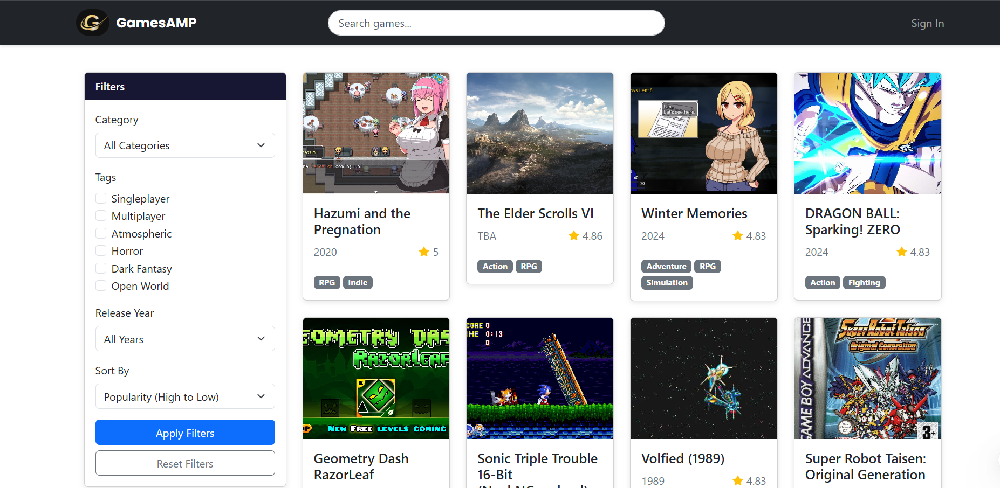
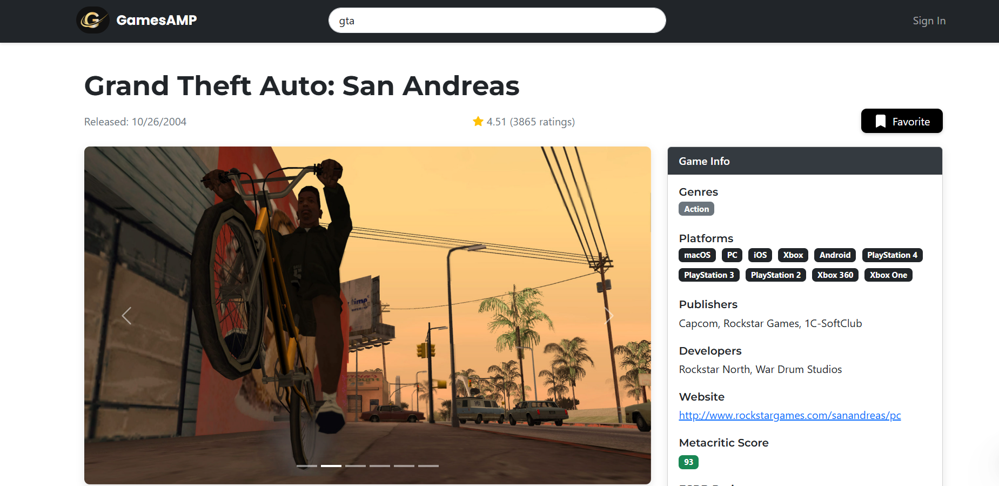
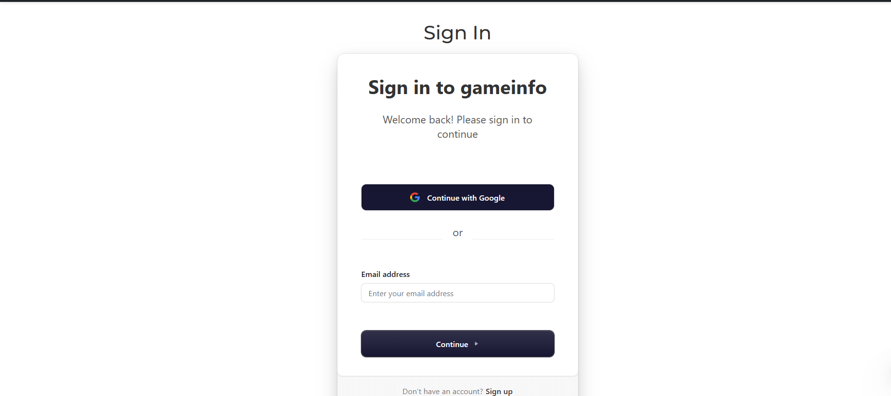

# GamesAMP

## 🧩 Features

- 🔍 Browse popular and upcoming games using the RAWG API
- 📄 View detailed info like screenshots, ratings, genres, system requirements, and more
- ⭐ Add/remove games to/from your personal library (favorites)
- 🔐 Sign in/out using Clerk authentication
- 📱 Fully responsive layout
- 🎯 Pagination for navigating through games easily

## 📸 Screenshots

### 🏠 Home Page

### 🕹️ Game Details

### 🔐 Login Page

  ## 🛠️ Tech Stack

| Tech         | Purpose                          |
|--------------|----------------------------------|
| React.js     | Frontend framework               |
| RAWG API     | Game data & screenshots          |
| Clerk        | User authentication              |
| Redux        | State management (favorites)     |
| React Bootstrap | UI components & styling      |
| React Router | Routing and navigation           |
